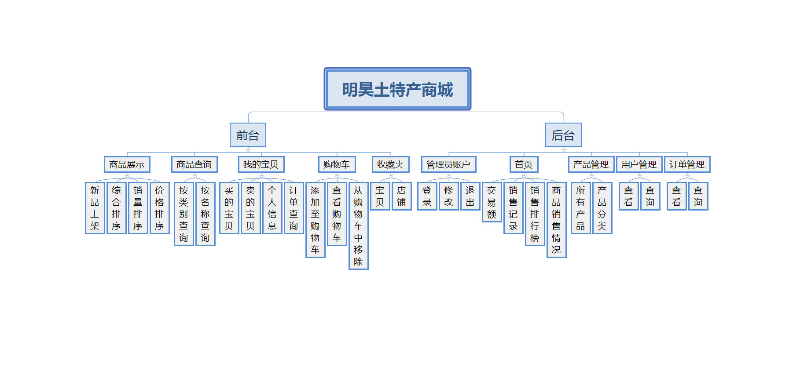

# 明昊土特产商城

#### 介绍
明昊土特产商城是一个基于Spring Boot的综合性B2C电商平台，需求设计主要参考天猫商城的购物流程：用户从注册开始，到完成登录，可以按照类别、名称进行浏览商品，加入购物车，进行下单，确认收货，评价等一系列操作。 作为土特产商城的核心组成部分之一的土特产商城数据管理后台包含商品管理，订单管理，类别管理，用户管理和交易额统计等模块，可以通过柱状图、饼状图、折线图来查看近一周的销售情况，方便直观，从而实现了对整个商城的一站式管理和维护。

#### 软件架构

#### 安装教程

1、项目使用IntelliJ IDEA开发，请使用IntelliJ IDEA的版本控制检出功能，输入“https://gitee.com/project_team    /Tmall_demo.git”拉取项目即可。
2、项目数据库为MySQL 8.0版本，在sqls文件夹中找到SQL文件并导入到数据库中。
3、使用IDEA打开项目后，在maven面板刷新项目，下载依赖包。
4、配置数据库连接并启动MingHaoSpringBootApplication即可。

#### k8s部署的项目访问网址:

    前台：127.0.0.1:8080/minghao
    后台：127.0.0.1:8080/minghao/admin

#### 注意事项

1.后台管理界面的订单图表没有数据为正常现象，该图表显示的为近一周的交易额。
2.该项目同时兼容eclipse，但如有自行扩展代码的意愿，建议使用IDEA。
3.所有页面均兼容IE10及以上现代浏览器。

### 作者的话

首先感谢您看到这里

本项目是我在校完成的一个毕设项目商城demo

前后台业务代码，都是自主完成，后台都是专门设计的样式，前台是参考天猫自行开发界面

技术日新月异，目前我们在使用更流行的前后台技术栈，从而开源更多优质项目

但我们仍记得，我们对这个项目付出的热情和精力

在校开发不易，如对您有帮助，您可以给予我们一点支持!

